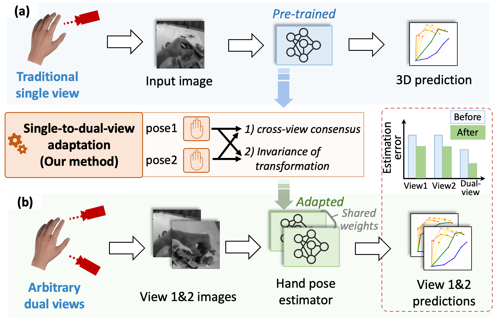
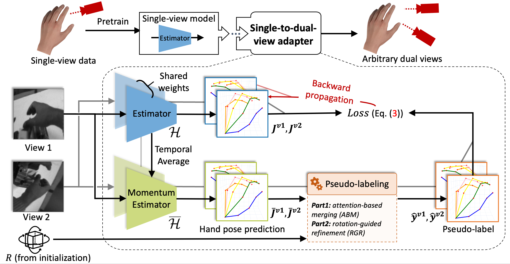
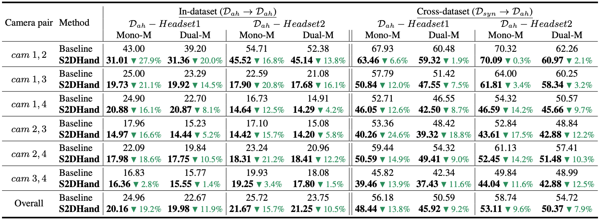

Single-to-Dual-View Adaptation for Egocentric 3D Hand Pose Estimation
---
[](https://arxiv.org/pdf/2403.04381.pdf)


Our paper is accepted by **CVPR-2024**

<div align=center>   </div>

**Picture:**  *Overview of the proposed Single-to-Dual-view framework for adapting a traditional single-view hand pose estimator to arbitrary dual views.*

<div align=center>   </div>

**Picture:**  *The proposed architecture.*

---

**Results**

<div align=center>   </div>


This repository contains the official PyTorch implementation of the following paper:

> **Single-to-Dual-View Adaptation for Egocentric 3D Hand Pose Estimation**<br>
Ruicong Liu, Takehiko Ohkawa, Mingfang Zhang, and Yoichi Sato<br> <!-- >  https://arxiv.org/abs/  -->
> 
>**Abstract:**   The pursuit of accurate 3D hand pose estimation stands as a keystone for understanding human activity in the realm of egocentric vision. The majority of existing estimation methods still rely on single-view images as input, leading to potential limitations, e.g., limited field-of-view and ambiguity in depth. To address these problems, adding another camera to better capture the shape of hands is a practical direction. However, existing multi-view hand pose estimation methods suffer from two main drawbacks: 1) Requiring multi-view annotations for training, which are expensive. 2) During testing, the model becomes inapplicable if camera parameters/layout are not the same as those used in training. In this paper, we propose a novel Single-to-Dual-view adaptation (S2DHand) solution that adapts a pre-trained single-view estimator to dual views. Compared with existing multi-view training methods, 1) our adaptation process is unsupervised, eliminating the need for multi-view annotation. 2) Moreover, our method can handle arbitrary dual-view pairs with unknown camera parameters, making the model applicable to diverse camera settings. Specifically, S2DHand is built on certain stereo constraints, including pair-wise cross-view consensus and invariance of transformation between both views. These two stereo constraints are used in a complementary manner to generate pseudo-labels, allowing reliable adaptation. Evaluation results reveal that S2DHand achieves significant improvements on arbitrary camera pairs under both in-dataset and cross-dataset settings, and outperforms existing adaptation methods with leading performance.

## Resources

Material related to our paper is available via the following links:

- Paper: https://arxiv.org/pdf/2403.04381.pdf
- Code: https://github.com/ut-vision/S2DHand
- AssemblyHands dataset: https://assemblyhands.github.io/
- Pre-trained models: https://drive.google.com/file/d/1rn-ez1rBjELTgcx1hU4gXgkH41ezBJbK/view?usp=sharing

## System requirements

* Only Linux is tested.
* 64-bit Python 3.10 installation. 

## Playing with pre-trained networks and training

### Data preparation

Please download the pre-trained models and AssemblyHands dataset first. Assuming the pre-trained models and dataset are stored under ${DATA_DIR}. The structure of ${DATA_DIR} follows

```
- ${DATA_DIR}
    - AsseblyHands
        - annotations
        - images      
    - S2DHand-pretrain 
        - ckp_detnet_37.pth
        - ckp_detnet_68.pth
```
Please run the following command to register the pre-trained model and data.
```
cp ${DATA_DIR}/S2DHand-pretrain/* pretrain
mkdir data
mkdir data/assemblyhands
ln -s ${DATA_DIR}/AssemblyHands/* data/assemblyhands
```

Optional: This code will automatically check all invalid data when first run, which takes lots of time. To save time, you can download the pre-generated invalid.txt [here](https://drive.google.com/file/d/19wZ0qaB6VivI7JxN-1Wlr0LP3aVHzRt8/view?usp=sharing) and move it to `${DATA_DIR}/AssemblyHands/annotations/${split}`. For example, move `invalid_train_ego.txt` to `${DATA_DIR}/AssemblyHands/annotations/train`.  

### Single-to-Dual-View Adaptation (Training)

`run.sh` provides a complete procedure of training and testing. The `adapt_detnet_dual.py` automatically tests the adapted model after each epoch of adaptation.

We provide several arguments for adaptation:

`-trs` and `-tes`. They represent training and testing dataset, please set it to "ah" (assemblyhands).

`--root_idx` represents the root joint index for alignment. Remember to set it as 0 for in-dataset adaptation while 9 for cross-dataset. This is because the pre-trained models are trained under different `root_idx`s.

`--pic` number of image pairs for adaptation or evaluation, set to `--pic=-1` for using all image pairs..

`--checkpoint` directory to save models or load the model for evaluation.

`--resume` remember to add this argument for adaptation from an initial model.

`--evaluate` please use this argument of testing/evaluating an existing model.

`-eid, --evaluate_id` determines which epoch's model is used for adaptation or evaluation. Note that the code will first look for the model in `--checkpoint`.

`--epochs` number of adaptation epochs.

`--start_epoch` start epoch for saving models.

`--setup` can be set as 0 or 1, which stands for the id of the two headsets from AssemblyHands.

`--pair` determines which dual-camera pair is used for adaptation for evaluation. Possible values: `0,1 0,2 0,3 1,2 1,3 2,3`.

`--gpus` gpu id.


We also provide other arguments for adjusting the hyperparameters in our S2DHand architecture, which could be found in our paper.

For example, run code like:

```bash
python3 adapt_detnet_dual.py -trs ah -tes ah --root_idx 0 --pic 1024 --resume -eid 37 --epochs 10 --start_epoch 1 --gpus 0 --checkpoint in_dataset_adapt --setup 0 --pair 1,2
```

If first running this code, the `pretrain/ckp_detnet_37.pth` model will be adapted to the camera pair `1,2` of headset 0. 1024 images pairs will be used and there are 10 adaptation epochs in total.

### Test

All arguments are the same as training.

Usually, extra testing is not necessary, as it will be automatically done after adaptation. Still, we can run code like:

```bash
python3 adapt_detnet_dual.py -trs ah -tes ah --evaluate -eid 37 --gpus 0 --pic -1 --checkpoint pretrain --setup 0 --pair 1,3
```

This will test the pre-trained weights `pretrain/ckp_detnet_37.pth` on the camera pair `1,3` of headset 0.

**Note**: the result printed is **NOT** the final result on the specific dual-camera pair. It only contains **SINGLE-VIEW** evaluation results.

Running `calc_metrics.py` is needed to get two metrics on the pair we adapt to. These two metrics are the final results, which are described in our paper.

```bash
python3 calc_metrics.py --checkpoint in_dataset_adapt/evaluation/ah --setup 0 --pair 1,2
```
The `--checkpoint, --setup, --pair` arguments share the same definition with adaptation and testing. The result should be like:

```
1-setx-x,x: num:..., Mono-M:..., Dual-M:..., ...
2-setx-x,x: ...
...
10-setx-x,x: ...
```

Please refer to `run.sh` for a complete procedure from training to testing.

### In-dataset & Cross-dataset adaptation
Setting `-eid=37` indicates in-dataset adaptation, while `-eid=68` indicate cross-dataset. This is because `ckp_detnet_37.pth` is trained on AssemblyHands while `ckp_detnet_68.pth` is trained on RHD and GANerated Hand.

**Remember to set `--root_idx=0` for in-dataset adaptation while `--root_idx=9` for cross-dataset.**

### Visualization
Run `visualize.py` for visualization. However, cropped assemblyhands images are required. Please refer [here](https://drive.google.com/file/d/1hhfzHzlhjKFLkhgkxKRG_W7rc-2eFwWy/view?usp=sharing) for our cropped images.

Please run the following command to register the cropped data for visualization.
```
ln -s assemblyhands_crop data
```

Then, run code like:
```bash
python3 visualize.py --checkpoint in_dataset_adapt/evaluation/ah -eid 37 --sample_idx 0 --setup 0 --pair 1,3
```

**Note**: the visualization requires log file, which is generated by testing. Therefore, it is necessary to run testing (e.g., `python3 adapt_detnet_dual.py -trs ah -tes ah --evaluate -eid 37 --gpus 0 --pic -1 --checkpoint pretrain --setup 0 --pair 1,3`) before visualization. You may want to set `--pic` as a small value for a shorter testing time.

The `--sample_idx` indicates the index of sample for visualization. If it goes well, we can see the predictions and ground-truth labels on the images pair we choose.

## Citation

If this work or code is helpful in your research, please cite:

```latex
@inproceedings{liu2024single,
 title = {Single-to-Dual-View Adaptation for Egocentric 3D Hand Pose Estimation},
 author = {Liu, Ruicong and Ohkawa, Takehiko and Zhang, Mingfang and Sato, Yoichi},
 booktitle = {Proceedings of the IEEE/CVF Conference on Computer Vision and Pattern Recognition},
 pages = {0--0},
 year = {2024}
}
```
If you are using the detnet network in this project, please also cite its original paper:

```latex
@inproceedings{zhou2020monocular,
  title={Monocular real-time hand shape and motion capture using multi-modal data},
  author={Zhou, Yuxiao and Habermann, Marc and Xu, Weipeng and Habibie, Ikhsanul and Theobalt, Christian and Xu, Feng},
  booktitle={Proceedings of the IEEE/CVF Conference on Computer Vision and Pattern Recognition},
  pages={5346--5355},
  year={2020}
}
```
This project is built on an unofficial PyTorch reimplementation of `Zhou et al. Monocular real-time hand shape and motion capture using multi-modal data. CVPR2020`. Original project page: https://github.com/MengHao666/Minimal-Hand-pytorch.

## Contact

For any questions, including algorithms and datasets, feel free to contact me by email: `lruicong(at)iis.u-tokyo.ac.jp`
